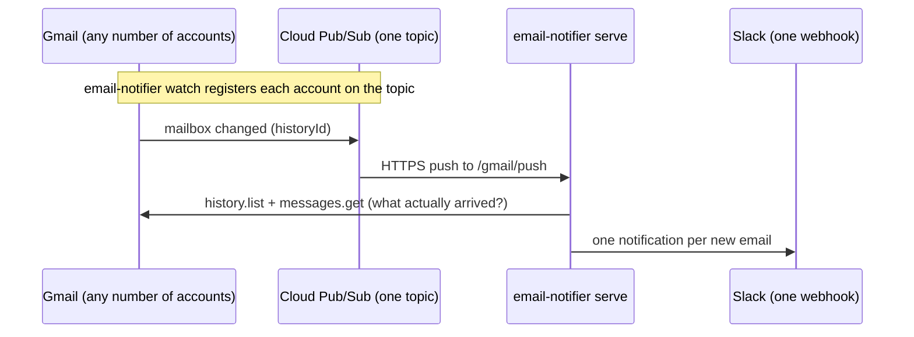

# email-notifier

Get a Slack message the moment a new email arrives — for as many email
accounts as you like, all posting to one Slack channel through a single
incoming webhook.

The current version supports **Gmail** (via real push notifications — Gmail →
Cloud Pub/Sub → this app — no polling). The provider layer is pluggable so
Outlook and other services can be added later; see
[docs/extending.md](docs/extending.md).

## How it works



Gmail pushes never contain the mail itself — only "something changed". The
server keeps a per-account cursor (`state.json`) and asks the Gmail history
API for everything after it, so no message is missed even if pushes are
dropped or coalesced.

## Requirements

- Python **3.13+**
- A Slack workspace where you can create an app ([docs/slack-setup.md](docs/slack-setup.md))
- A Google Cloud project with the Gmail and Pub/Sub APIs ([docs/gmail-setup.md](docs/gmail-setup.md))
- An HTTPS URL that reaches the server (a small VM, Cloud Run, or ngrok while testing)

## Quickstart

```bash
git clone <your-repo-url> && cd email-notification
python3.13 -m venv .venv && source .venv/bin/activate
pip install -e .

cp config.example.toml config.toml   # then edit it
```

1. **Slack** — create an incoming webhook and put its URL in `config.toml`
   (or in the `SLACK_WEBHOOK_URL` environment variable):
   follow [docs/slack-setup.md](docs/slack-setup.md), then verify with
   `email-notifier test-slack`.
2. **Google Cloud** — create the OAuth client (`credentials.json`) and the
   Pub/Sub topic + push subscription: follow
   [docs/gmail-setup.md](docs/gmail-setup.md).
3. **Authorize each Gmail account** (opens a browser once per account):

   ```bash
   email-notifier auth personal
   email-notifier auth work
   ```

4. **Start watching and serving:**

   ```bash
   email-notifier watch    # registers Gmail → Pub/Sub push for every account
   email-notifier serve    # receives the pushes on :8000/gmail/push
   ```

Send yourself an email — it should appear in Slack within seconds.

> **Keep watches alive:** Gmail watches expire after ~7 days. Run
> `email-notifier watch` at least daily, e.g. with cron:
> `0 6 * * * cd /path/to/email-notification && .venv/bin/email-notifier watch`

## CLI reference

| Command | What it does |
| --- | --- |
| `email-notifier auth <account>` | Runs the Google OAuth consent flow for one configured account and stores its token. |
| `email-notifier watch [--account NAME]` | Registers/renews the Gmail → Pub/Sub push watch (all accounts by default). |
| `email-notifier serve [--host H] [--port P]` | Runs the HTTP endpoint that receives Pub/Sub pushes. |
| `email-notifier test-slack` | Sends a test message through the configured webhook. |

All commands accept `--config <path>` (default `./config.toml`).

## Configuration

See [config.example.toml](config.example.toml) — it documents every key.
Secrets can come from the environment instead of the file:
`SLACK_WEBHOOK_URL` and `PUBSUB_VERIFICATION_TOKEN`.

## Development

```bash
pip install -e ".[dev]"
pytest              # runs tests with a 95% branch-coverage gate
ruff check .        # lint
ruff format .       # format
```

CI (GitHub Actions) runs the same three gates on every push to `main` and every pull request.

## Documentation

- [docs/slack-setup.md](docs/slack-setup.md) — create the Slack app and incoming webhook
- [docs/gmail-setup.md](docs/gmail-setup.md) — Google Cloud project, OAuth client, Pub/Sub topic and push subscription
- [docs/extending.md](docs/extending.md) — add a new email provider (e.g. Outlook)
